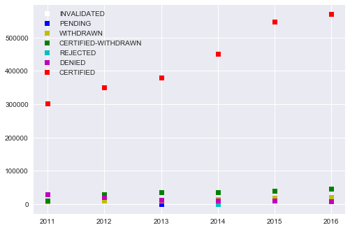
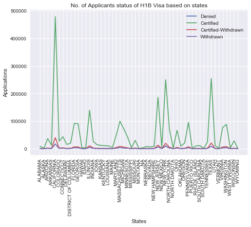

# H1B Visa Data_Set Analysis
             
            
_The H1B Visa data set contains data regarding acceptance of applicants in a particular Year and States/places (These are the data we are analyzing)._


### Tools
	* Anaconda
	* Jupyter Notebook

### Libraries and Packages required
	_In order to analyze the data set, we have to import the following libraries.(For the current github code)_
	* pandas
	* matplotlib
	* IPython
	* seaborn
	* numpy
	

#### What are we analysing?
	We are analysing using the database to understand,the number of individual
	selection ratio throughout the years from 2011 to 2016 and the selection rate
	based on each states.
		
_To analyse a data, we have to read the cvs file, which can be done using pandas._
_Below snipet will help to understand, how we can read a csv file._

```python
h1b = pd.read_csv("h1b_kaggle.csv")
```

*How to plot graphs of the data analyzed.*

_We have to first collect some data from the csv file, so that we can input
our data to the graph. _

In this example, the graph ploted are scatterplot and line graphs.Both graphs represent two different anaysis of the data set.

  - Analysis of applicants certified, denied,withdrawn etc in particular years from     2011 to 2016.
  
  - Analysis of applicants selected/Denied bassed on state.


### Code Analysis


#### Analyzing the columns and rows using the Apis head and tail

```python
h1b.head()
```
|CASE_STATUS  |EMPLOYER_NAME|SOC_NAME|JOB_TITLE|FULL_TIME_POSITION|PREVAILING_WAGE|YEAR|WORKSITE|lon| lat |
|---|:-----------:|:-----------:|:--------------:|:------------:|:-----------:|:-----------:|:--------------:|:------------:|--------------:|
|CERTIFIED-WITHDRAWN|	UNIVERSITY OF MICHIGAN|	BIOCHEMISTS AND BIOPHYSICISTS|	POSTDOCTORAL RESEARCH FELLOW|	N	|36067.0|	2016.0	}ANN ARBOR, MICHIGAN|	-83.743038|	42.280826|
|CERTIFIED-WITHDRAWN|	GOODMAN NETWORKS, INC.|	CHIEF EXECUTIVES| CHIEF OPERATING OFFICER|	Y	|242674.0|	2016.0|	PLANO, TEXAS|	-96.698886|	33.019843|
|CERTIFIED-WITHDRAWN|	PORTS AMERICA GROUP, INC.|	CHIEF EXECUTIVES|	CHIEF PROCESS OFFICER|	Y|	193066.0|	2016.0|	JERSEY CITY, NEW JERSEY|	-74.077642|	40.728158|
|CERTIFIED-WITHDRAWN|	GATES CORPORATION, A WHOLLY-OWNED SUBSIDIARY| 	CHIEF EXECUTIVES	REGIONAL PRESIDEN, AMERICAS|	Y|	220314.0|	2016.0|	DENVER, COLORADO|	-104.990251|	39.739236|
|WITHDRAWN|	PEABODY INVESTMENTS CORP.|	CHIEF EXECUTIVES|	PRESIDENT MONGOLIA AND INDIA	|Y|	157518.4|	2016.0|	ST. LOUIS, MISSOURI|	-90.199404|	38.627003|

``` python
# Similar output as above, but the data is fetched from the bottom i.e. last rows.
h1b.tail()

```

#### Deleting unwanted columns for Analysis

```python
h1b = h1b.iloc[:,1:]
h1b = h1b.iloc[:, :8]
```


#### Analysing if there are lot of NAN's 

```python

# With Nan 
h1b["CASE_STATUS"].value_counts()

```

```python
# Analyse all the case status except for the NAN
h1b = h1b.dropna()

# Taking only one column of certified status
h1b["CASE_STATUS"].value_counts()
```
**Note :** _Since there is no much diference in the data,droping the NaNs_


#### Segregating data for each year based on the outcome of each application


_Taking only the columns required into the year data frame and then filtering it, based on the status._

```python
# Cleaning the data for Analysing Approvals and rejections
year = h1b.drop(h1b.columns[[1,2,3,4,5,7]], axis=1)
year = year[year["CASE_STATUS"] == "CERTIFIED"]
Certified_per_year = year["YEAR"].value_counts()
```
**Note :** _Similar operation done for each status_

#### Plot Graph

**_Ploting scatter plot based on the status for each year._**

```python
labels1 = 'INVALIDATED', 'PENDING', 'WITHDRAWN','CERTIFIED-WITHDRAWN', 'REJECTED','DENIED','CERTIFIED'

plt.plot(I_per_year,'ws', P_per_year,'bs', W_per_year,'ys', CW_per_year,'gs',R_per_year,'cs',Denied_per_year,'ms',Certified_per_year,'rs')
plt.legend(('INVALIDATED', 'PENDING', 'WITHDRAWN','CERTIFIED-WITHDRAWN', 'REJECTED','DENIED','CERTIFIED'))
plt.show()
```

_Below is the graph for the analysis_

 


### Analysing the application status based on states

#### Seperating state and city name from the column worksite

```python
h1b1 = []
h1 = []
for i in h1b["WORKSITE"]:
    h1 = i.split(',')
    # h1[1] contains the state name
    h1b1.append(h1[1])
    
```

#### Converting it into data frame

_In order to analyse the data, we have to convert the list to a data frame._

```python
df = pd.DataFrame({'col':h1b1})
# printing the dataframe on to the console
df['col'].value_counts()

```

#### Concating two data frame

_Taking both the data frame required into a list and then by using pandas concatinating two together._

```python
data_frame = [h1b,df]
data_frame = pd.concat(data_frame, axis=1)

```

#### Segregating or cleaning data for analysis


```python
data_frame = data_frame.dropna()
states = data_frame.drop(data_frame.columns[[1,2,3,4,5,6,7]], axis=1)

``` 

**_Filtering the data frame based on the status of each application and states_**

```python
certified_states = states[states["CASE_STATUS"] == "CERTIFIED"]
denied_states = states[states["CASE_STATUS"] == "DENIED"]
cw_states = states[states["CASE_STATUS"] == "CERTIFIED-WITHDRAWN"]
w_states = states[states["CASE_STATUS"] == "WITHDRAWN"]
```

#### Ploting Graph

**_Ploting line plot for the applications status based on states_**

_Sorting the x-axis i.e the states for proper alignment of data_

```python
h = sorted(set(h1b1))
```

_Even the data of all the states count are sorted_

```python
objects = h

y_pos = np.arange(len(objects))

performance0 = denied_states['col'].value_counts().sort_index()
performance1 = certified_states['col'].value_counts().sort_index()
performance2 = cw_states['col'].value_counts().sort_index()
performance3 = w_states['col'].value_counts().sort_index()


plt.plot(y_pos, performance0, label = 'Denied')
plt.plot(y_pos, performance1, label = 'Certified')
plt.plot(y_pos, performance2, label = 'Certified-Withdrawn')
plt.plot(y_pos, performance3, label = 'Withdrawn')

plt.xticks(y_pos, objects,rotation=90)
plt.xlabel('States')
plt.ylabel('Applications')
plt.title('No. of Applicants status of H1B Visa based on states')
plt.legend()
plt.show()
```

_Below graph is the analysis of the above data_




### Conclusion :

Using the data in the database, the analysis helped to understand,
how many individulas where selected each year and also, which states are where
most individuals are selected throughout these years(2011-2016).


**Kaggle Site:**
https://www.kaggle.com/jerrinv/iris-data-set


### Author
**Jerrin Joe Varghese**


